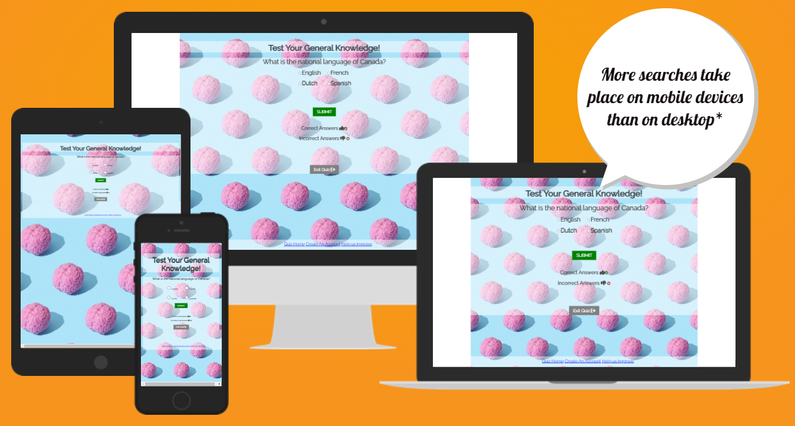

# PORTFOLIO 1 - "Test Your General Knowedge"

'Test your general knowledge' is an online quiz game with general knowledge questions. The website is aimed at people aged 10 and up, although some questions are more challenging and some more straight forward. The website is designed to be fun and engaging, allowing users to create their own username and provide feedback on the type of questions they'd like to be included.

Below you can see the site on different screen sizes. Taken from [Am I responsive](https://amiresponsive.co.uk/).

The live site can be found [here](https://sacarr98.github.io/Portfolio_Two/)
---

## CONTENTS

- [PORTFOLIO 1 - "Test your General Knowledge"](#portfolio-1---test your general knowledge)
  - [CONTENTS](#contents)
  - [User Experience (UX)](#user-experience-ux)
    - [User Stories](#user-stories)
      - [First Time Visitor Goals](#first-time-visitor-goals)
  - [Design](#design)
    - [Colour Scheme](#colour-scheme)
    - [Typography](#typography)
    - [Imagery](#imagery)
    - [Wireframes](#wireframes)
  - [Features](#features)
    - [General features on each page](#general-features-on-each-page)
    - [Future Implementations](#future-implementations)
    - [Accessibility](#accessibility)
  - [Technologies Used](#technologies-used)
    - [Languages Used](#languages-used)
    - [Frameworks, Libraries \& Programs Used](#frameworks-libraries--programs-used)
  - [Deployment \& Local Development](#deployment--local-development)
    - [Deployment](#deployment)
    - [Local Development](#local-development)
      - [How to Fork](#how-to-fork)
      - [How to Clone](#how-to-clone)
  - [Testing](#testing)
  - [Credits](#credits)
    - [Code Used](#code-used)
    - [Content](#content)
    - [ Media](#media)
    - [ Acknowledgments](#acknowledgments)

---

## User Experience (UX)

### User Stories

#### First Time Visitor Goals

- We wanted first time visitors first impressions to be that this was a fun website, hence the colorscheme
- First time visitors should find the website easy to navigate
- The quiz content should be challenging enough to engage first time users but not too challenging as to put them off returning to the site
- The questions should encourage users to do their own research into various areas of general knowledge when they don't know the answers to improve their general knowledge

## Design

### Colour Scheme

We wanted a bright and fun colorscheme to show the fun nature of the game, but wanted to ensure text was still easily readable. So the game area has a transluscent white background so the background image can still be seen but the text is easy to read.

### Typography

Google Fonts was used to import the chosen fonts for this site.

We chose "Raleway" as we felt this easy to read and in keeping with the fun vibe we wanted the website to have.

### Imagery

The imagery used was kept minimal as to not distract the players from the quiz, but a bright background image was chosen with contrasting colors that look happy and exciting. This background image was used throughout the site for continuity.

### Wireframes

## Features

The website comprised of 3 pages, the index page, a feedback page, and a sign-up page. An array was used to iterate through the quiz questions on the index page.

### General features on each page

All pages feature a footer with links to the other pages, a main heading showing the content of the page and then the main content section (game area, sign-up, feedback).

### Future Implementations

In future I would like to create a login option in order to create a user network so users can encourage eachother on their journey in improved mental well-being.

### Accessibility

We have actively tried to ensure our website is accessible friendly as possible, we achieved this by:

- Using semantic HTML
- Ensuring sufficient colour contrast throughout the site and using easily readable fonts
- Providing information for screen readers where icons were used in place of text

## Technologies Used

### Languages Used

HTML, CSS, JavaScript

### Frameworks, Libraries & Programs Used

Balsamiq - for wireframes
Git - for version control
Github - to save and store files
Google Fonts - to import all fonts
Font Awesome - for the iconography
Google Dev Tools - to troubleshoot and test features
Pexels - to download copyright free images

## Deployment & Local Development

### Deployment

The site is deployed using GitHub Pages. Visit the deployed site here. To deploy using GitHub pages:

Login or Sign Up to GitHub.
Open the project repository.
Click on "Settings" on the navigation bar under the repository title.
Click on "Pages" in the left hand navigation panel.
Under "Source", choose which branch to deploy. This should be Main for newer repositories (older repositories may still use Master).
Choose which folder to deploy from, usually "/root".
Click "Save", then wait for it to be deployed. It can take some time for the page to be fully deployed.
Your URL will be displayed above "Source".

### Local Development

#### How to Fork

To fork the repository:

- Log in to Github
- Go to the repository for this project
- Click the Fork button in the top right corner

#### How to Clone

To clone the repository:

- Log in to GitHub
- Go to the repository for this project
- Click on the code button, select whether you would like to clone with HTTPS, SSH or GitHub CLI and copy the link shown.
- Open the terminal in your code editor and change the current working directory to the location you want to use for the cloned directory.
- Type 'git clone' into the terminal and then paste the link you copied in step 3. Press enter.

## Testing

Testing documentation can be found [here](TESTING.md)

## Credits

### Code Used

The code was written by myself with some parts being taken from the Love Maths Project - for example the scoring (counting correct and incorrect answers), and I used https://www.geeksforgeeks.org/ forum to look into the best way to create an online quiz, where I found using an array was the most common and straightforward method.

### Content

The content for the site was created by myself, with the general knowledge questions being taken from https://triviaquestions4u.com/multiple-choice-trivia-questions-and-answer/ .

###  Media

- <a href="https://www.pexels.com/photo/brains-with-a-light-blue-background-9228382/">Background image</a>

###  Acknowledgments

Thanks to the tutors at Code Institute for always being on hand when I needed some help with my code, and to my mentor for their guidence and advice.
