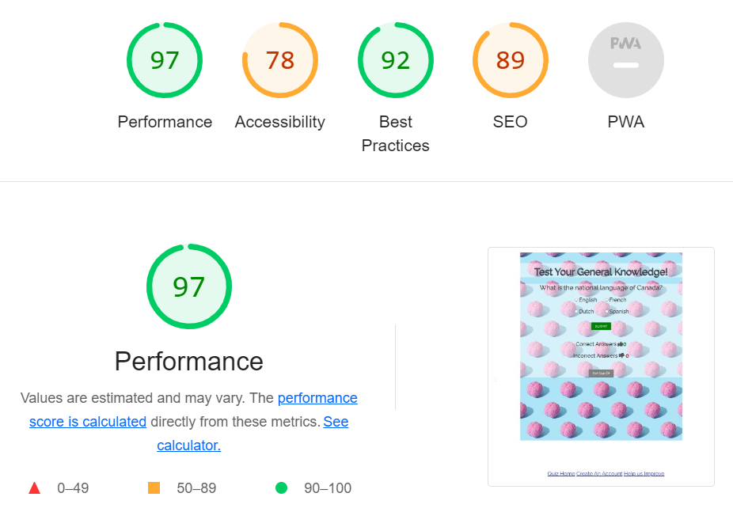
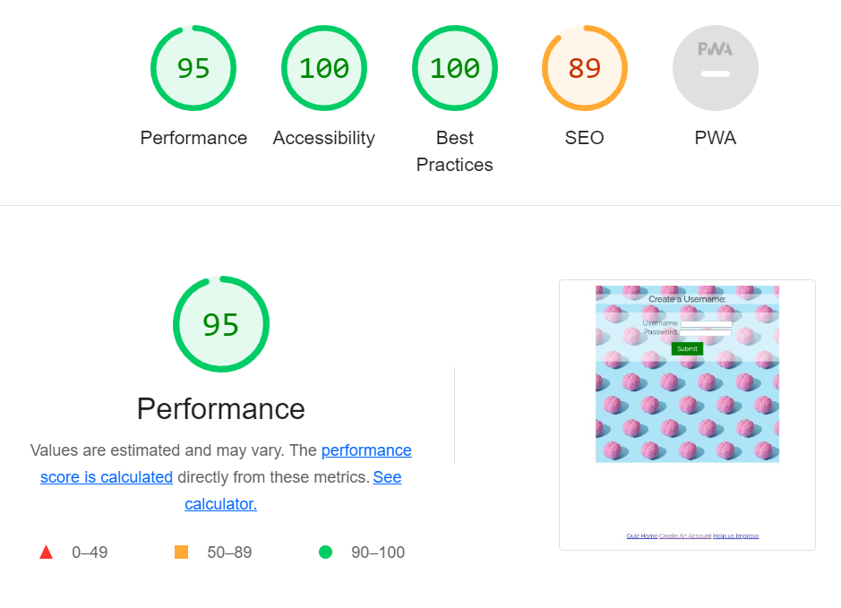
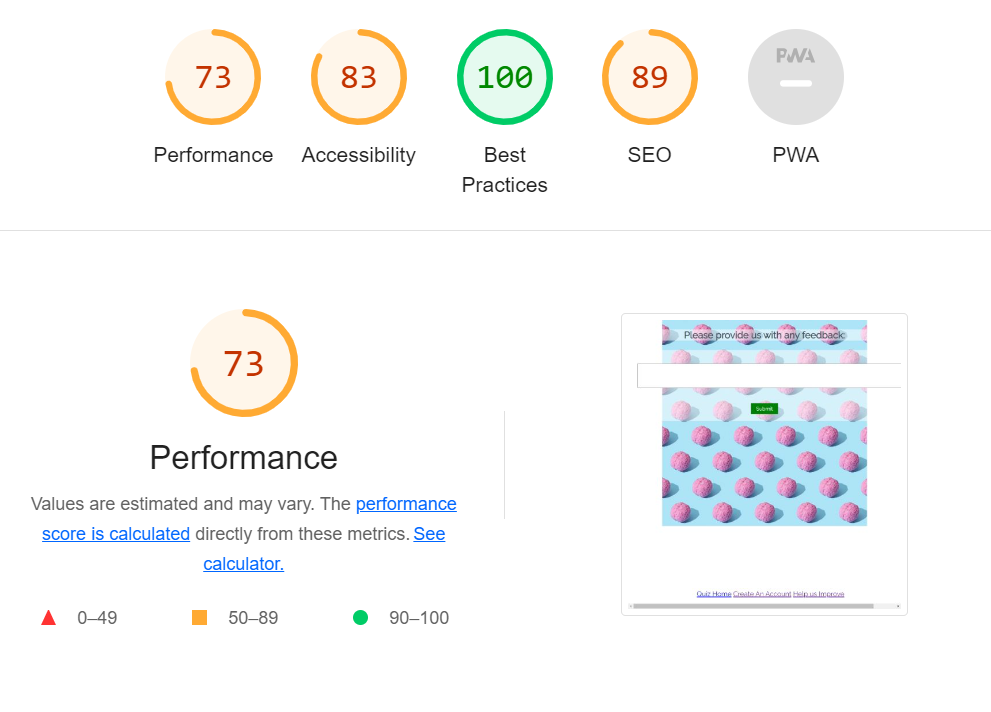

# Test Your General Knowledge -  Testing

Visit the deployed site: [Test Your General Knowledge](https://sacarr98.github.io/Portfolio_Two/)
- - -

## CONTENTS

- [Test Your General Knowledge -  Testing](#test your general knowledge----testing)
  - [CONTENTS](#contents)
  - [AUTOMATED TESTING](#automated-testing)
    - [W3C Validator](#w3c-validator)
    - [Lighthouse](#lighthouse)
    - [Results](#results)
  - [MANUAL TESTING](#manual-testing)
    - [Testing User Stories](#testing-user-stories)
    - [Full Testing](#full-testing)
  - [BUGS](#bugs)
    - [Known Bugs](#known-bugs)
    - [Solved Bugs](#solved-bugs)

Testing was ongoing throughout the entire process. Chrome developer tools was used whilst building to find and troubleshoot any issues.

I have analysed each page using google chrome developer tools to ensure the responsiveness of all pages on different screen sizes.

- - -

## AUTOMATED TESTING

### W3C Validator

[W3C](https://validator.w3.org/) was used to validate the HTML on all pages of the website. It was also used to validate the CSS.

* [index.html] - Passed, no errors or warnings to show.
* [signup.html] - Passed, no errors or warnings to show.
* [feedback.html] - Passed, no errors or warnings to show.
* [style.css] - Passed, no errors or warnings to show.

### Lighthouse

I used Lighthouse within the Chrome Developer Tools to test the performance, accessibility, best practices and SEO of the website.

### Results

All pages achieved a minimum of 92 for best practices, and an average of 88 for performance.

### JSHint

I used JSHint to evaluate the JavaScript Code.

### Results

It was found that one variable was undefined (username) resulting in errors on the signup page, this has since been resolved.

## MANUAL TESTING

### Testing User Stories

`First Time Visitors`

| Goals | How are they achieved? |
| :--- | :--- |
| I want to improve my general knowledge. | Test Your General Knowledge provides a variety of questions on lots of different topics. |
| I want the site to be responsive to my device. | I have developed the site with responsiveness in mind. |
| I want the site to be easy to navigate. | The site is simple and easy to use with consistant styling throughout.  |

`Returning Visitors`

|  Goals | How are they achieved? |
| :--- | :--- |
| I want to be able to track my progress. | Going forward I would like to add a user window that shows the users previous scores to monitor users activities and their progress. |

`Frequent Visitors`

| Goals | How are they achieved? |
| :--- | :--- |
| I want to be able to select questions on specific genres | I would like to add more questions that fall under specific topics e.g. geography/music/science so that users can improve their knowledge in areas of weakness.

### Full Testing

Full testing was performed on the following devices:

* Laptop:
  * Microsoft surface laptop
* Mobile Devices:
  * iPhone 13 mini

Each device tested the site using the following browsers:

* Google Chrome
* Safari

| Feature | Expected Outcome | Testing Performed | Result | Pass/Fail |
| --- | --- | --- | --- | --- |
| `Game Area` |
|  |  |  |  |  |
| Submit button | When clicked the user answer will be submitted and next question loaded. | Button clicked | Answer checked, next question loads | Pass |
| User answer checkbox | When clicked box will be checked and . | Clicked box | Answer checked | Pass |
| `Footer` |
|  |  |  |  |  |
| Quiz Home Page Link | When clicked the user will be redirected to the home page.| Clicked link | Redirected to the home page. | Pass |
| Feedback Link | When clicked the user will be redirected to the feedback page.| Clicked link | Redirected to the home page. | Pass |
| Signup Link | When clicked the user will be redirected to the signup page. | Clicked link | Redirected to the mind page | Pass |
| Submit button | When clicked the user answer will be submitted and next question loaded. | Button clicked | Answer checked, next question loads |
| `Signup Page` |
| | | | | | |
| Username taken | Cannot have matching username with other user | Tried to submit form with matching username | Tooltip lets user know this value is taken | Pass |
| Submit | Should clear field and display acknowledgement message | Created new user and submitted form | field cleared and message appears | Pass |
| `Feedback Page` |
| | | | | | |
| Submit | Should clear field and display acknowledgement message | Created new user and submitted form | field cleared and message appears | Pass |
 - - -

## BUGS

### Known Bugs

| No | Bug | How I solved the issue |
| :--- | :--- | :--- |
| 1 | The initial banner text was clear on some pages but difficult to read against the background on others | By adding a shadow the text had better readability  |
| 2 | When adding media queries to my index page the footer was sitting on top of the text content | I realised this was due to the text content being larger than the div container, by resizing the div container I solved this |
| 3 | Initially when moving through pages on the navigation bar the underline did not move to the relvent page | By ensuring all pages were set to "active" I solved this issue. |

### Solved Bugs

| No | Bug | |
| :--- | :--- | :--- |